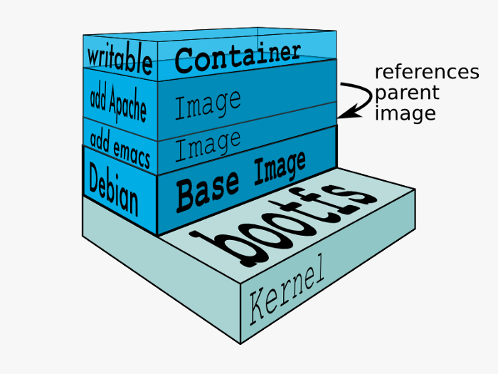
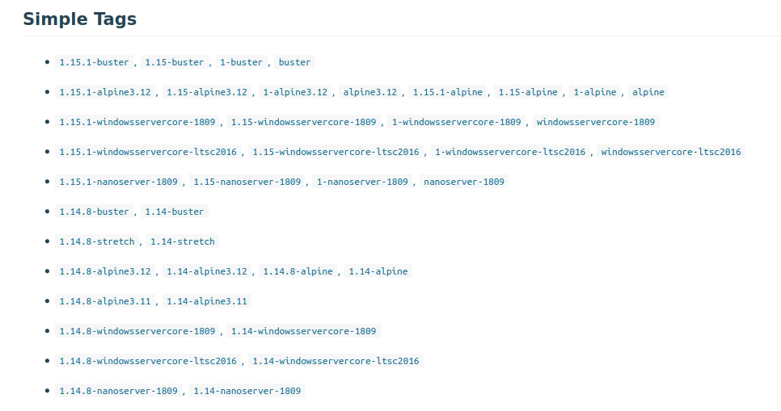

== Problemet med flere applikasjoner på en maskin
* Deler avhengigheter
* Vansklig å begerense ressurser.
  ** To Java-applikasjoner vil slåss om CPU.
* Nettverk
  ** Må ha kontroll på hvilke porter som er i bruk.

== Hvorfor containere?
* Distribuere applikasjon med avhenigheter.
  ** Isolert applikasjonsmiljø
* Mulighet for å ressursstyre containere.
* Enklere å sette opp nettverkstrafikk mot applikasjonene.

== !

== Begreper
// Et sett med kommandoer
// Beskriver hva og hvordan innhold skal kjøres. Pakkes til et image.
// OS, hvilke egenskaper skal det ha, konfigurasjon, skal den kunne nås på http?, hva skal kjøres i containeren.
* Dockerfile
// Et produkt av Dockerfile. 
// An image does not have state and it never changes
* Image
// Versjonering av images
* Tag
// Kjørende instans av et image.
* Container
// En database som inneholder images.
* Registry

== Begreper
plantuml::docker.puml["docker", "png"]

== Dockerfile
[.scroll]
[source]
----
include::../../../apps/greeter/Dockerfile[]
----

== Image er lagdelt
* Hver kommando i Dockerfile oppretter et lag.
* Flere images kan gjenbruke tidligere lag. Sparer diskplass og gir raskere byggetid.
* Vær bevisst på hvordan lag kan påvirke neste kommando.

== Image er immutable
* Det er ikke mulig å endre et image etter det er bygd.
* For å kunne gjøre endringer i et image så må man bygge på nytt.

== Tagging av Image
* Brukes for å si noe om versjon og variant av et image.

== Container
* Ikke mulig å kunne gjøre endring på host fra en container.
* Containere deler kjerne med host.
* Hvis noen skulle finne sikkerhetshull i kernel så kan dette potensielt utnyttes fra containeren.
* Best practice: Ikke kjør containeren som root-bruker.
  ** Konfigureres i Dockerfile

== Container Registry
* Lokal registry
  ** `docker images`
* Distribuerte container registries:
  ** DockerHub (Mest kjent)
  ** Quay (Red Hat)
  ** Google-, Azure-, Amazon (elastic) container registry
  ** Nexus Container Registry

== Demo
// Vis app
// Forklar Dockerfile
// To reduce complexity, dependencies, file sizes, and build times, avoid installing extra or unnecessary packages just because they might be “nice to have.” For example, you don’t need to include a text editor in a database image.
// For the ADD and COPY instructions, the contents of the file(s) in the image are examined and a checksum is calculated for each file. The last-modified and last-accessed times of the file(s) are not considered in these checksums. During the cache lookup, the checksum is compared against the checksum in the existing images. If anything has changed in the file(s), such as the contents and metadata, then the cache is invalidated.
// Bygg
// Tag
// Start image
// Vise noen kjekke docker kommandoer
// - Publiser image til DockerHub
// - Start Image fra DockerHub

== Annet
* Docker Compose
* Docker Swarm

