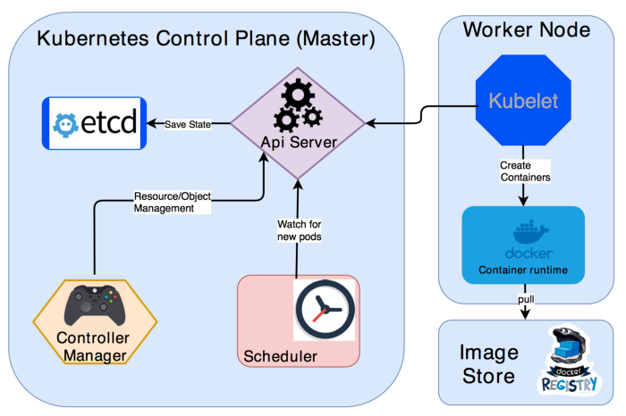

== !
[.single-headline2]
Kubernetes

== Hvorfor Kubernetes
 * kjøre applikasjoner uten å bry seg for mye om servere/nettverk osv.
 * kjøre flere applikasjoner som prater sammen
 * håndtere oppgradering og sletting av applikasjoner ikke bare at man lager nye
 * kjøre en applikasjon i flere instanser og lastbalansere trafikk mellom dem

== Hvilke egenskaper gir det deg
 * oppgradere en applikasjon til en ny versjon i fart
 * rulle tilbake ved feil
 * skalere en applikasjon i flere instanser
 * styre trafikken til applikasjonen mellom forskjellige versjoner

== Kjerneprinsipper
 * deklarativ konfigurasjon i yaml eller json
 * konfigurasjon er ønsket tilstand
 * apiGrupper og ressurser
 * merkelapper (labels)
 * komponere ressurser ved å bruke andre ressurser
 * tilgangskontroll på ressurs/gruppe nivå

== !


== Pod
- en pod er den minste 'deploybare' enheten på kubernetes
- alle andre høyere nivå konsepter har Pods i bunnen

== Pod Eksempel
[source,yaml]
----
include::kubernetes/pod-uia-app.yaml[]
----

== Demo
 - kjøre vår app på Kubernetes

== Ressurser
plantuml::kubernetes.puml["kubernetes","png"]

== Typer workload
- Jobs/CronJobs
- Deployment
- StatefulSet
- DaemonSet

Kubernetes demo	15 min
Opprett Pod ressurs med referanse til vårt image på DockerHub
Apply Pod-ressurs
Undersøk applikasjon på Kubernetes
Deployment, ReplicaSet, Secret, Ingress?
Illustrer hvordan flyten henger sammen.


== Trafikk inn til Pod
```
k expose pod uia-app  --port=8080 --type=LoadBalancer
```