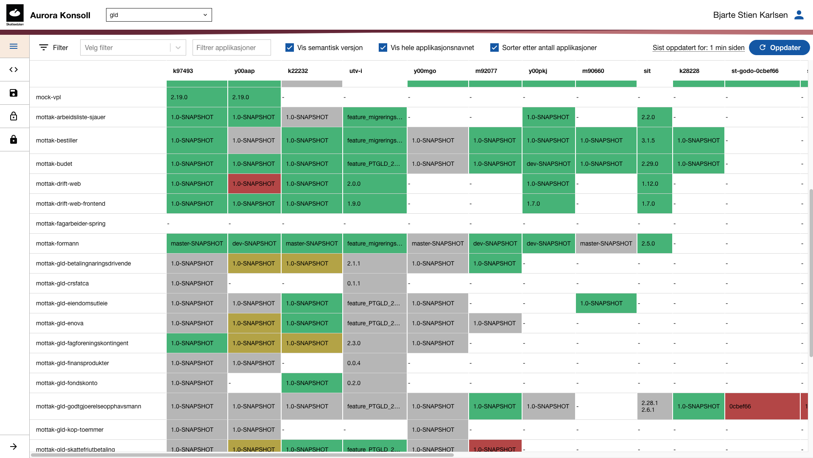
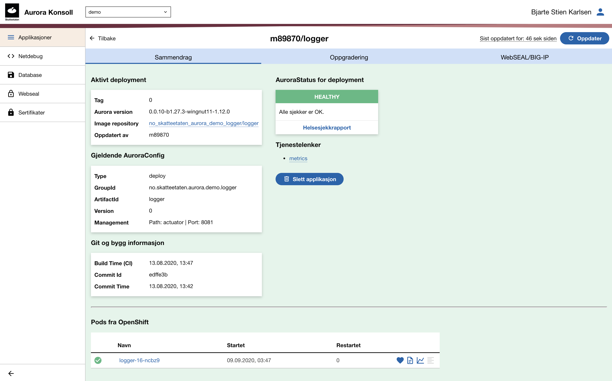
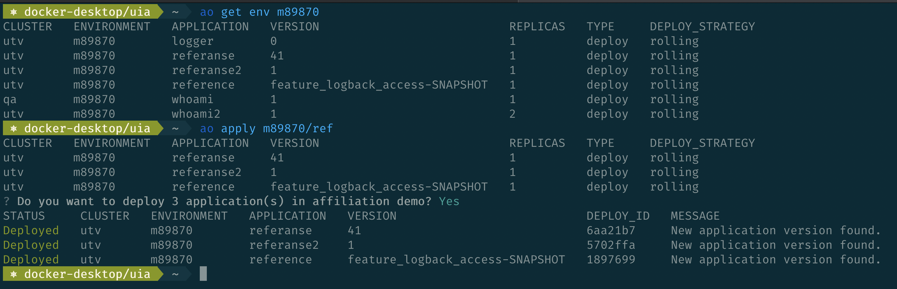

== Kubernetes i Skatteetaten
 * Har kjørt OpenShift siden 2015
 ** en distribusjon av Kubernetes fra RedHat
 * ønsket en 'industrialisert' plattform hvor team kan være produktive.

== Aurora Plattform
 * https://github.com/skatteetaten
 * https://skatteetaten.github.io/aurora/
 * implementasjonen av plattformen er skjult for utviklerne
 * 3 formelle kontrakter

== Verktøy
 * egen kommando linje klient `ao`
 * et web-gui for å se "lite" om "mye" siden de eksisterende verktøyene er motsatt

== !

== !

== !

== Byggekontrakt
* deklarativ pipeline for hvordan bygge en applikasjon
** jenkins og jenkinsfile
* Produsererer zip fil av en applikasjon som lagres sentralt
** metadata
** parametre til applikasjonen
** evt biblioteker
* sentralisert bygger som bygger docker imagene
** http://github.com/skatteetaten/architect

== Deploykontrakt
* deklarativ AuroraConfig
** komponere konfigurasjon
* oppgraderingsstrategi
** latest, ingen brekkende endringer, nye features, nye feilfikser, 'patcher', låst, samme som produksjon, SNAPSHOT
* deploy vil overskrive eksisterende state

== Aurora Config
* 4 konfigfiler som til sammen blir en konfigurasjon
* about.json : globalfil
* whoami.json : basefil
* utv/about.json : miljøfil
* utv/whoami.json : applikasjonsfil

== Globalfil
[source,json]
.about.json
----
include::script/about.json[]
----

== Basefil
[source,json]
.whoami.json
----
include::script/whoami.json[]
----

== Miljøfil
[source,json]
.utv/about.json
----
include::script/utv/about.json[]
----

== Applikasjonsfil
[source,json]
.utv/whoami.json
----
include::script/utv/whoami.json[]
----

== Sammenslått konfigurasjon
[source,json]
.utv/whoami
----
include::script/whoami-final.json[]
----

== Kjørekontrakt
* microservices/12-faktor
* management interface
  - separere app og admin trafikk på forskjellige porter
* kan og vil bli drept hvis plattformen krever det
* bruk delt logge konfigurasjon